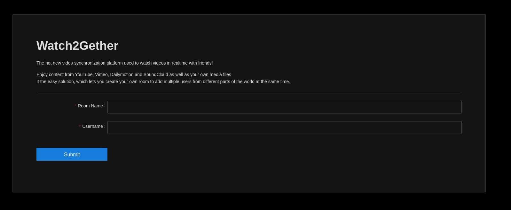
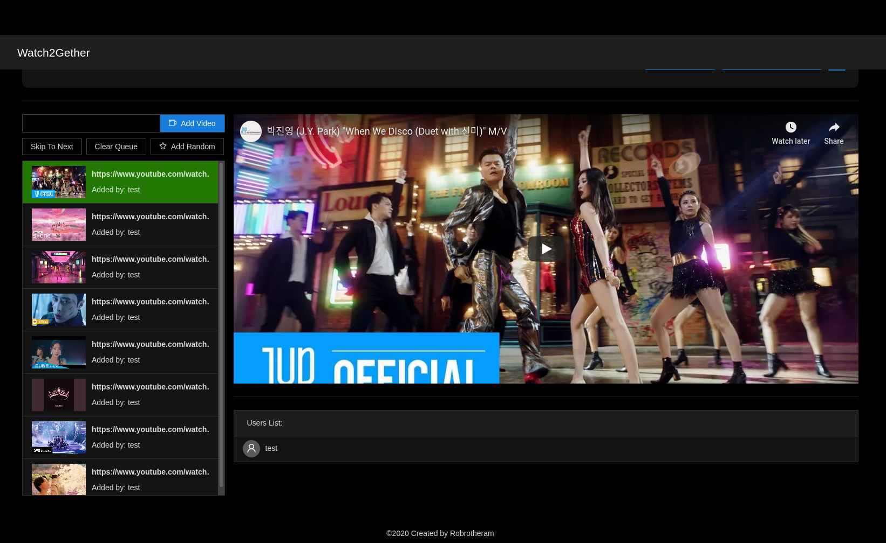

# go-watch2gether
'Ever wanted to watch youtube videos in-sync with your friends, via. web-browser?  or mp4s?'

Its Yet another video sync website it currently support Youtube, DailyMotion Vimeo Soundcloud and Videos hosted on your own fileserver that you totally legally own😉

## Why? 
This project spun out of my quest to find something that would allow my group of friends watch vidoes together from the random collection of YouTube clips to long movies. All other services did not support playing mp4 files or had features that were not required for example chat. This is little webapp does not need API keys to be set up and users do not need to create any accouts. Just create a room share a link and people can join. 

## Features
### Random Videos
From project I found https://vynchronize.herokuapp.com/ it had a Random KPOP button since I found that a fun thing to have this project has its own version except its a bit more random collection of music from our discored playlist Just enjoy the randomness and you can always add more the list [here](https://github.com/robrotheram/go-watch2gether/blob/main/ui/src/components/VideoQueue/RandomVideo.js)

### Host
The first person to the room is elected as the Host they can transfere the host to anyone in the room once they have joind.
As host you have some limited controls. You can currently disable player controls for other participants.

### Room Cleanup 
The application has a cleanup routine that is running to keep resouces down. If a user has been inactive for more then 10 seconds then they are droped from the room and if a room has no participents in it will close. This is all to reduce the number of websockets connections that are open.


## Installing
This application packaged as a docker container. 
You can run it with 

```
docker run -d -p 8080:8080 robrotheram/watch2gether
```

There is also a Docker-compose file avalible. 

For running behind a proxy you will need to forward websoctes as well as http. Below is a sample nginx configuration

```
	server {
        server_name watch2gether.<YOUR DOMAIN>;
        listen 80;
        location / {
        proxy_set_header        Host $host;
        proxy_set_header        X-Real-IP $remote_addr;
        proxy_set_header        X-Forwarded-For $proxy_add_x_forwarded_for;
        proxy_set_header        X-Forwarded-Proto $scheme;
		proxy_set_header 		Upgrade $http_upgrade;
    	proxy_set_header        Connection "upgrade";
        proxy_pass          	http://127.0.0.1:8080;
        proxy_read_timeout  90;
        }
    }
```


## Building
This project uses a server wiritten in go with a react frontend. 
Built with:

go 1.15+ 

Yarn v1.22.10

UI Framework:

Antd v4.9+

There is a handy make file that will build the server, ui and container. 
```
make build
```


# Screenshots

