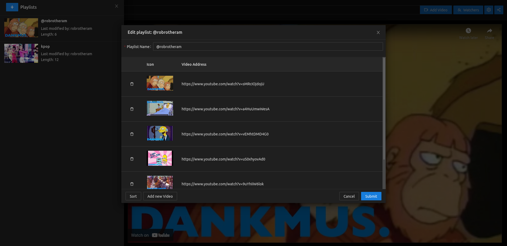
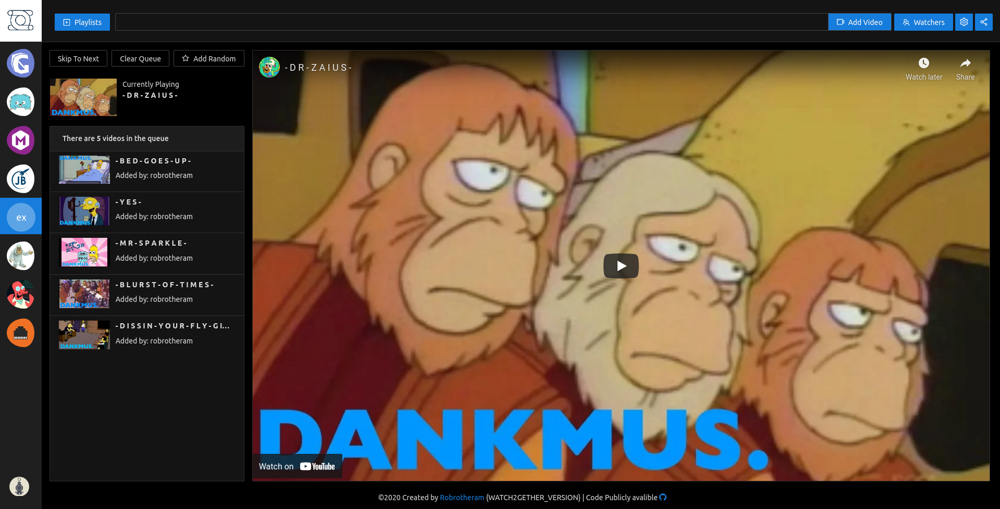
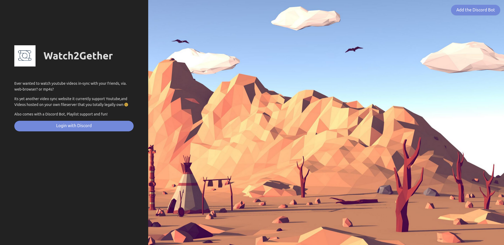

# Watch2gether
'Ever is Discord listening to youtube video via RythumBot and wanted to watch youtube videos in-sync with your friends, or play custom playlists/

Yest Its Yet another video sync website it currently support Youtube, DailyMotion Vimeo Soundcloud and Videos hosted on your own fileserver that you totally legally own😉

## Why? 
This project spun out of my quest to find something that would allow my group of friends watch vidoes together from the random collection of YouTube clips to long movies. All other services did not support playing mp4 files or had features that were not required for example chat. This is little webapp does not need API keys to be set up and users do not need to create any accouts. Just create a room share a link and people can join. 

## Features
### Listen In discord

Listen in dissord. Using commands that do not iterfeer with Rythm Bot commands. (Currently supports only YT through the bot)
Full list of commands 
```
- !w help : This is a Help Command 
- !w history : List videos alreay played 
- !w join : Join Bot to a voice channel 
- !w leave : Disconnect Bot from channel 

- !w pause : Pause Video 
- !w skip : Skip to next video in the Queue 
- !w play : Play Video 
- !w stop : Stop Video 
- !w queue : List videos in the Queue 
- !w add <video> : Add Video to Queue 

- !w playlist load <name>
- !w status : Current Status of what is playing 
- !w watch : Get Link to room
```

### Playlists

Watch2gether can save custom playlists without having them public in youtube. 


## Installing
This application packaged as a docker container. 
You can run it with 

```
docker run -d -p 8080:8080 robrotheram/watch2gether
```

There is also a Docker-compose file avalible. 

For running behind a proxy you will need to forward websoctes as well as http. Below is a sample nginx configuration

```
	server {
        server_name watch2gether.<YOUR DOMAIN>;
        listen 80;
        location / {
        proxy_set_header        Host $host;
        proxy_set_header        X-Real-IP $remote_addr;
        proxy_set_header        X-Forwarded-For $proxy_add_x_forwarded_for;
        proxy_set_header        X-Forwarded-Proto $scheme;
		proxy_set_header 		Upgrade $http_upgrade;
    	proxy_set_header        Connection "upgrade";
        proxy_pass          	http://127.0.0.1:8080;
        proxy_read_timeout  90;
        }
    }
```


## Building
This project uses a server wiritten in go with a react frontend. 
Built with:

go 1.15+ 

Yarn v1.22.10

UI Framework:

Antd v4.9+

There is a handy make file that will build the server, ui and container. 
```
make build
```


# Screenshots

